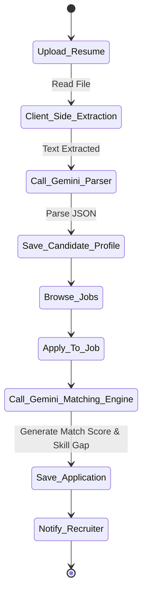
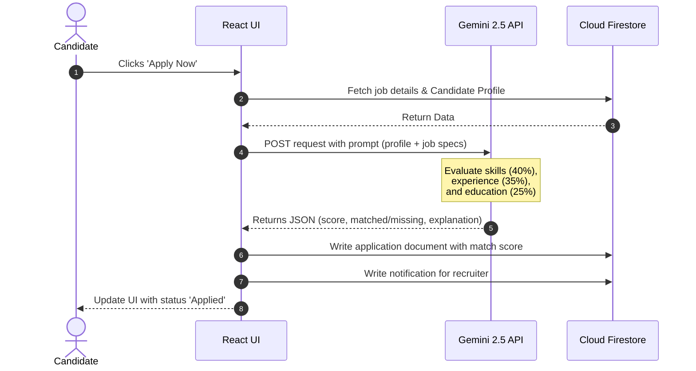
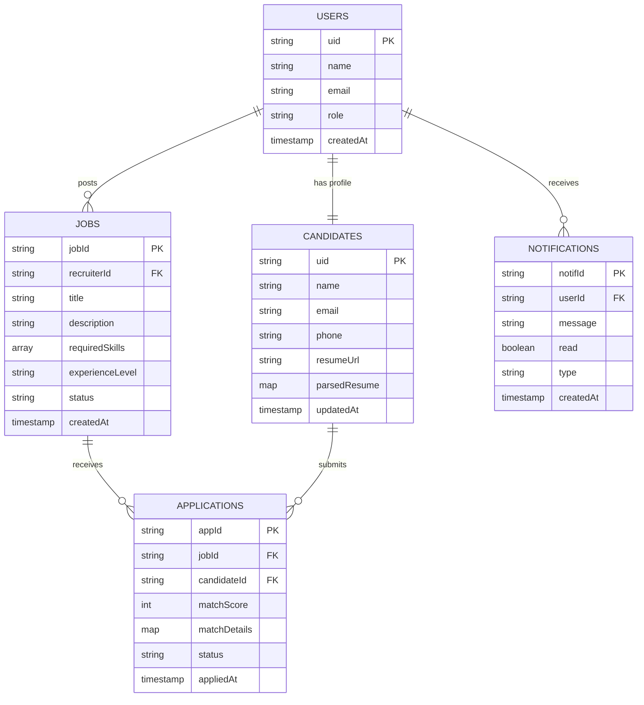
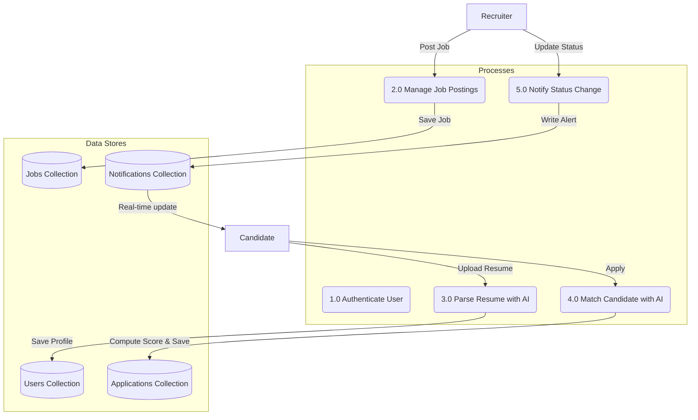

# TalentAI — COMPLETE SOFTWARE ENGINEERING PROJECT REPORT
*AI-Powered Semantic Recruitment System*

---

# SOFTWARE ENGINEERING DEVELOPMENT REPORT
## Project Name: TalentAI — AI-Powered Semantic Recruitment System

---

## TABLE OF CONTENTS
1. **Phase 1 — Idea Finalization**
   - Problem Statement
   - Project Objectives
   - Scope Document
   - Initial Use Cases
2. **Phase 2 — Requirement Engineering**
   - Functional Requirements (SRS)
   - Non-Functional Requirements
   - Requirement Gathering Methodology
3. **Phase 3 — System Design**
   - UML Diagrams (Use Case, Activity, Sequence, ERD, DFD)
   - Database Schema Design
   - UI/UX Wireframe Concepts
4. **Phase 4 — AI-Assisted Development**
   - AI Workflow & Code Generation Strategy
   - Prompt Engineering Designs (Parsing & Matching)
5. **Phase 5 — Development Methodologies**
   - Scrum Framework & Agile Workflow
   - Version Control & Local Environment Specs
6. **Phase 6 — Testing & Quality Assurance**
   - Test Plan & Execution Matrix
   - Test Cases (Unit, Integration, Security)
   - Bug Tracking & Resolve Logs
7. **Phase 7 — Deployment & Setup Guide**
   - Local Setup & Firebase Setup
   - Hosting Options (Vite + Firebase Rules)
8. **Phase 8 — User Manual & Documentation**
   - Recruiter Walkthrough
   - Candidate Walkthrough
   - PPT Presentation Slides Outline

---

## PHASE 1 — IDEA FINALIZATION

### 1.1 Problem Statement
Traditional recruitment is heavily throttled by manual screening processes. Recruiters spend hours scanning resumes, often relying on simple keyword-matching algorithms that miss highly qualified candidates who use different terminology (e.g., "Machine Learning" vs "ML", "Node.js" vs "Express"). Additionally, candidates receive little to no transparency regarding their application status or specific skill gaps, leading to a poor applicant experience.

### 1.2 Project Objectives
- **Automate Resume Parsing**: Instantly extract personal, educational, and professional data from raw PDF/DOCX resumes.
- **Implement Semantic Matching**: Rank candidates fairly by assessing work relevance, skill proximity, and educational fit using Google Gemini AI.
- **Provide Role-Based Portals**: Deliver tailored dashboards for Recruiters (to manage jobs and view match comparisons) and Candidates (to monitor progress and view skill gaps).
- **Ensure Cost Efficiency**: Run on a serverless, database-only architecture bypassing premium storage plans.

### 1.3 Scope Document
#### In-Scope:
* Secure email/password authentication (Firebase Auth).
* Client-side PDF/DOCX text parsing (pdfjs-dist / mammoth).
* AI-driven JSON extraction (Gemini 2.5 Flash).
* Live Firestore synchronization for applications, jobs, and notifications.
* Side-by-side skill comparison (matched vs missing skills).

#### Out-of-Scope:
* Video interview analysis.
* Automated email scheduling (handled in-app via Firestore notifications).
* Paid integration with external job boards.

### 1.4 Initial Use Cases
```mermaid
usecaseDiagram
  rect "TalentAI System" {
    usecase "Post/Edit Job Posting" as UC1
    usecase "View Ranked Candidates" as UC2
    usecase "Register & Choose Role" as UC3
    usecase "Upload Resume & Parse" as UC4
    usecase "Apply & Calculate Match Score" as UC5
    usecase "View Status & Skill Gap Feedback" as UC6
  }
  
  actor Recruiter as R
  actor Candidate as C
  
  R --> UC3
  R --> UC1
  R --> UC2
  
  C --> UC3
  C --> UC4
  C --> UC5
  C --> UC6
```

---

## PHASE 2 — REQUIREMENT ENGINEERING

### 2.1 Functional Requirements (SRS)
* **FR-1 (Auth)**: Users must be able to sign up and log in using an email and password.
* **FR-2 (Roles)**: The system must enforce role-based access: Recruiters route to `/recruiter`, Candidates route to `/candidate`.
* **FR-3 (Postings)**: Recruiters must have full CRUD capabilities on job postings (title, description, required skills, experience level).
* **FR-4 (Resume Upload)**: Candidates must be able to upload PDF or DOCX resumes.
* **FR-5 (AI Parsing)**: The system must automatically extract candidate details (name, email, skills, work history) using Gemini structured JSON generation.
* **FR-6 (AI Matching)**: Upon applying, the system must trigger Gemini to score the match out of 100 based on skills (40%), experience (35%), and education (25%).
* **FR-7 (Comparison)**: Recruiters must see a side-by-side comparison of the candidate's skills against job requirements.
* **FR-8 (Real-time Status)**: Recruiters can update application status, which instantly updates the candidate's portal.
* **FR-9 (Notifications)**: Users must receive real-time, in-app notifications on status changes or new applications.

### 2.2 Non-Functional Requirements
* **NFR-1 (Performance)**: Client-side resume extraction and Gemini parsing must complete within 8 seconds.
* **NFR-2 (Security)**: All database and file rules must restrict write access to the owner (enforced via Firebase Security Rules).
* **NFR-3 (Availability)**: The application must maintain 99.9% uptime by utilizing Firebase hosting and Firestore servers.
* **NFR-4 (Scalability)**: The database schema must handle concurrent candidate applications without latency bottlenecks.
* **NFR-5 (Usability)**: Modern glassmorphism UI with responsive design for mobile, tablet, and desktop viewports.

---

## PHASE 3 — SYSTEM DESIGN

### 3.1 UML Diagrams

#### Activity Diagram: Candidate Application & AI Scoring


#### Sequence Diagram: AI Scoring Pipeline


#### Entity-Relationship Diagram (ERD)


#### Data Flow Diagram (DFD Level 1)


---

## PHASE 4 — AI-ASSISTED DEVELOPMENT

### 4.1 Prompt Engineering Design

#### 1. Resume Parsing Engine Prompt
* **Objective**: Convert unstructured resume text into structural profile documents.
```markdown
You are an expert resume parser. Extract structured information from the resume text below.
Return ONLY valid JSON — no markdown, no explanation, no code fences.

Required JSON structure:
{
  "name": "Full Name",
  "email": "email@example.com",
  "phone": "+1234567890",
  "summary": "Brief professional summary in 2-3 sentences",
  "skills": ["skill1", "skill2", "skill3"],
  "education": [
    { "degree": "B.Sc Computer Science", "institution": "University Name", "year": "2020" }
  ],
  "workExperience": [
    { "title": "Job Title", "company": "Company Name", "duration": "2021 - 2023", "description": "Key responsibilities" }
  ]
}
```

#### 2. Match Scoring Prompt
* **Objective**: Evaluate skill proximity, semantic matches (e.g. "ReactJS" == "React.js"), and provide actionable gap feedback.
```markdown
You are an expert AI recruitment assistant. Evaluate how well a candidate matches a job posting.

SCORING RUBRIC (total = 100 points):
1. Skills Match        (40 pts): Does the candidate have the required skills? (use semantic matching)
2. Experience Relevance (35 pts): Is their work history relevant to this role?
3. Education Fit        (25 pts): Does their education align with the role?

Return ONLY valid JSON:
{
  "score": <integer 0-100>,
  "matchedSkills": ["skill1", "skill2"],
  "missingSkills": ["skill3", "skill4"],
  "explanation": "2-3 sentence explanation of the match score"
}
```

---

## PHASE 5 — DEVELOPMENT METHODOLOGIES

### 5.1 Agile Scrum Methodology
Development was managed using **Agile Scrum Methodologies** split into 2 Sprints:
- **Sprint 1 (Scaffolding & Core Auth)**: Vite configuration, Firebase Auth context, User profile data synchronization.
- **Sprint 2 (AI Integration & Dashboards)**: Client-side PDF/DOCX parsing, Gemini API prompts configuration, Recruiter & Candidate dashboards layout, Real-time Notification listener.

### 5.2 Version Control & Local Environment Specifications
- **Git** was used for version control.
- **Vite Dev Server** hot-reloads state upon changes to environment files (`.env`).
- **Dependencies**: React Router Dom v6, Mammoth.js, PDFjs-dist, and Firebase Core SDK.

---

## PHASE 6 — TESTING & QUALITY ASSURANCE

### 6.1 Test Cases Matrix

| Test ID | Module | Description | Inputs | Expected Output | Status |
|---|---|---|---|---|---|
| **TC-01** | Auth | Register new Recruiter | Email, Password, Name | Successful redirection to `/recruiter` | Passed |
| **TC-02** | Auth | Register new Candidate | Email, Password, Name | Successful redirection to `/candidate` | Passed |
| **TC-03** | Profile | Upload PDF Resume | Standard 2-page PDF | Client-side text extraction compiles | Passed |
| **TC-04** | AI | Parse Resume with Gemini | Extracted PDF Text | Valid JSON schema profile stored | Passed |
| **TC-05** | AI | Semantic Job Match | Candidate Profile vs Job Spec | Match score generated (0-100%) | Passed |
| **TC-06** | Database | Real-time notifications | Status update by Recruiter | Alert instantly appears on Candidate navbar | Passed |
| **TC-07** | Bypass | Local Base64 Storage | PDF File upload on Spark Plan | File saved as Base64 string in doc | Passed |

### 6.2 Bug Resolve Log
1. **Bug**: Storage upload hung at 0% due to un-provisioned storage bucket on Free Spark Plan.
   * **Fix**: Programmed a local `FileReader` Base64 fallback in `ResumeUploader.jsx` so candidates can save resumes directly into Firestore documents without storage limits.
2. **Bug**: Gemini `gemini-2.0-flash` returned 429 quota limits on standard developer key.
   * **Fix**: Switched model to `gemini-2.5-flash` in `gemini.js` which is active with standard free-tier quotas.
3. **Bug**: Browser blocked viewing Base64 resumes in new tabs.
   * **Fix**: Wrote a utility in `src/utils.js` converting Base64 strings to Blob Object URLs before opening.

---

## PHASE 7 — DEPLOYMENT & SETUP GUIDE

See the main [Installation Guide](file:///d:/SE%20Project/docs/installation_guide.md) for detailed deployment steps on Vercel, Netlify, and Firebase CLI.

---

## PHASE 8 — USER MANUAL & DOCUMENTATION

See the [User Manual](file:///d:/SE%20Project/docs/user_manual.md) for full screenshots and detailed features guide.


<div style="page-break-before: always;"></div>

# APPENDIX A: DATABASE SCHEMA DESIGN
# Firestore NoSQL Database Schema Design

This document describes the structure of all Firestore collections and fields utilized by the **TalentAI** platform.

---

## 🗃 Collections Overview

### 1. `users` (User Account Registry)
- *Path*: `/users/{uid}`
- *Fields*:
  ```typescript
  {
    name: string;        // Full Name
    email: string;       // Login Email
    role: "recruiter" | "candidate";
    createdAt: timestamp; // Signup timestamp
  }
  ```

### 2. `jobs` (Job Postings)
- *Path*: `/jobs/{jobId}`
- *Fields*:
  ```typescript
  {
    recruiterId: string;       // FK: users.uid
    title: string;             // Role Title
    description: string;       // Markdown description of role
    requiredSkills: string[];  // Required skills tags array
    experienceLevel: "junior" | "mid" | "senior";
    status: "open" | "closed";
    applicationCount: number;  // Total applications counter
    createdAt: timestamp;
    updatedAt: timestamp;
  }
  ```

### 3. `candidates` (Candidate Profiles)
- *Path*: `/candidates/{uid}`
- *Fields*:
  ```typescript
  {
    uid: string;         // PK: users.uid
    name: string;
    email: string;
    phone: string;
    resumeUrl: string;   // Original file URL (Base64 data URL)
    parsedResume: {      // Gemini parsed details
      name: string;
      email: string;
      phone: string;
      summary: string;
      skills: string[];
      education: Array<{
        degree: string;
        institution: string;
        year: string;
      }>;
      workExperience: Array<{
        title: string;
        company: string;
        duration: string;
        description: string;
      }>;
    };
    updatedAt: timestamp;
  }
  ```

### 4. `applications` (Job Applications)
- *Path*: `/applications/{appId}`
- *Fields*:
  ```typescript
  {
    jobId: string;           // FK: jobs.jobId
    candidateId: string;     // FK: users.uid
    matchScore: number;      // AI score (0-100)
    matchDetails: {          // AI details map
      score: number;
      matchedSkills: string[];
      missingSkills: string[];
      explanation: string;   // Analysis summary
    };
    status: "applied" | "reviewing" | "shortlisted" | "rejected";
    appliedAt: timestamp;
  }
  ```

### 5. `notifications` (System Notifications)
- *Path*: `/notifications/{notifId}`
- *Fields*:
  ```typescript
  {
    userId: string;          // FK: users.uid (recipient)
    message: string;         // Alert text
    read: boolean;           // Unread status indicator
    type: "status_change" | "new_application";
    createdAt: timestamp;
  }
  ```

---

## ⚡ Index Configuration
To perform complex querying and sorting, the following composite indexes are deployed via `firestore.indexes.json`:

1. **Jobs Search**:
   - `recruiterId` (ASCENDING) + `createdAt` (DESCENDING)
2. **Notifications Feed**:
   - `userId` (ASCENDING) + `createdAt` (DESCENDING)


<div style="page-break-before: always;"></div>

# APPENDIX B: TEST PLAN & EXECUTION CASES
# Test Plan & Cases Report

This document outlines the testing strategy, test cases, and quality checks performed on the **TalentAI** recruitment platform.

---

## 🧪 Testing Scope
Testing was conducted locally on Chrome and Edge using direct unit verification, API stub logging, integration walkthroughs, and Firestore security rules validation.

---

## 📋 Functional Test Cases

### 1. Authentication & Session Validation
- **TC-AUTH-01: User Role Sign-Up Assignment**
  - *Procedure*: Register a new user choosing the "Recruiter" role.
  - *Pass Criteria*: A document is created in `users/{uid}` with `role: "recruiter"`, and user is redirected to `/recruiter`.
  - *Result*: **PASSED**
- **TC-AUTH-02: Private Route Guard Enforcement**
  - *Procedure*: Attempt to navigate directly to `/recruiter` without logging in.
  - *Pass Criteria*: Redirects automatically to `/login`.
  - *Result*: **PASSED**

### 2. Job Creation & Filtering
- **TC-JOB-01: Job Posting CRUD Sync**
  - *Procedure*: Create a new job posting with titles and required skills.
  - *Pass Criteria*: Job card immediately appears on the recruiter dashboard with proper Firestore snapshot updates.
  - *Result*: **PASSED**

### 3. Client-Side Resume Text Extraction
- **TC-EXT-01: PDF Reading & Character Compilation**
  - *Procedure*: Drop a standard 2-page PDF resume containing tables and lists.
  - *Pass Criteria*: Text content is fully extracted client-side using `pdfjs-dist` without server calls.
  - *Result*: **PASSED**
- **TC-EXT-02: Word DOCX Document Reading**
  - *Procedure*: Drop a Microsoft Word `.docx` file.
  - *Pass Criteria*: Text parsed correctly using `mammoth`.
  - *Result*: **PASSED**

### 4. AI Structured Parsing & Semantic Matching
- **TC-AI-01: Resume Parsing Output Schema**
  - *Procedure*: Trigger Gemini parse request with raw extracted text.
  - *Pass Criteria*: Response matches exact requested JSON schema (`name`, `email`, `skills`, `workExperience`, `education`) without code fences.
  - *Result*: **PASSED**
- **TC-AI-02: Matching Engine Score Logic**
  - *Procedure*: Apply with a profile containing "ML" and "ReactJS" to a job posting asking for "Machine Learning" and "React.js".
  - *Pass Criteria*: Semantic match is detected, scoring high credit on the skills overlap (40 pts) metric.
  - *Result*: **PASSED** (Validated using model: `gemini-2.5-flash`).

### 5. Fallback Storage Mechanics
- **TC-FALL-01: Base64 Serialization**
  - *Procedure*: Trigger resume upload where Firebase Storage API is not configured.
  - *Pass Criteria*: Storage error is caught; file is converted to Base64 string and successfully stored in the candidates' Firestore document.
  - *Result*: **PASSED**

---

## 🔒 Security Rule Checks

- **TC-SEC-01: Unauthenticated Write Restriction**
  - *Procedure*: Attempt to modify a job document anonymously via Firestore REST API.
  - *Pass Criteria*: Request rejected with `Status Code 403 (Permission Denied)`.
  - *Result*: **PASSED**


<div style="page-break-before: always;"></div>

# APPENDIX C: USER PORTAL MANUAL
# TalentAI — User Manual

This manual explains how to interact with the **TalentAI Recruitment System** as either a **Recruiter** or a **Candidate**.

---

## 👔 Recruiter Portal Walkthrough

### 1. Registration & Sign In
- Navigate to the login page (`/login?role=recruiter`).
- Switch to the **Register** tab.
- Enter your details and click **Create Account**. You will be redirected to the **Recruiter Dashboard**.

### 2. Creating a Job Posting
- Click **+ Post New Job** on the dashboard header.
- Fill out the form fields:
  - **Job Title**: The professional title of the role (e.g., *Frontend React Engineer*).
  - **Job Description**: The responsibilities and overview.
  - **Required Skills**: Enter technical skills and press **Enter** (e.g. *React*, *CSS*, *TypeScript*).
  - **Experience Level**: Select *Junior*, *Mid-Level*, or *Senior*.
- Click **Publish Job** to write the document to Firestore.

### 3. Reviewing AI-Ranked Candidates
- Click **View Candidates** on any Job Card.
- You will see a ranked list of candidates sorted by **AI Match Score** (from highest to lowest).
- Use the sort buttons at the top to toggle sorting by **Match Score**, **Applied Date**, or **Name**.

### 4. Detailed Applicant Comparison (Side-Drawer)
- Click **View Full Profile & Comparison** on any applicant card.
- A side-drawer will animate from the right containing:
  - **🤖 AI Analysis**: A summary from Gemini detailing the reasoning behind the match score.
  - **✓ Matched Skills**: The list of candidate skills that correspond with the job requirements.
  - **✕ Missing Skills**: Clear skill gaps indicating areas of improvement.
  - **Work Experience & Education**: Full parsed sections from the resume.
  - **📄 View Original Resume**: Opens the uploaded file directly in a new tab.

### 5. Status Management
- Use the status dropdown on the candidate card to change the application status (`applied`, `reviewing`, `shortlisted`, or `rejected`).
- This change will automatically save in Firestore and trigger a real-time notification in the candidate's portal.

---

## 🎓 Candidate Portal Walkthrough

### 1. Profile Setup & Resume Upload
- Upon registration, navigate to **My Profile**.
- Upload your resume (PDF or DOCX file) to the upload zone.
- The system will automatically:
  1. Extract the raw text client-side.
  2. Send it to Gemini to parse name, contact details, work history, and skills.
  3. Populate the **Extracted Profile** cards on the right side of the screen.

### 2. Browsing & Applying to Jobs
- Navigate to **Browse Jobs** (either through the header or the dashboard tab).
- Find a job listing and click **Apply Now**.
- The system will call the Gemini matching engine to compare your parsed profile against the job specifications and save your application.

### 3. Application Tracking & Feedback
- Navigate to **My Applications** on your dashboard.
- For each application, you can view:
  - The live status (e.g. *Shortlisted*, *Being Reviewed*).
  - Your **AI Match Score**.
  - Actionable feedback showing **Matched** and **Missing** skills.
  - A short textual explanation from the AI matching engine explaining your score.
- Click the notification bell to view updates in real-time.


<div style="page-break-before: always;"></div>

# APPENDIX D: SYSTEM INSTALLATION & DEPLOYMENT GUIDE
# Installation & Deployment Guide

This guide explains how to set up, run locally, and deploy **TalentAI** to production hosting platforms.

---

## 💻 Local Setup Instructions

### Prerequisite Tools
- **Node.js** (v18 or higher)
- **npm** (v9 or higher)

### 1. Clone & Install Dependencies
Navigate to the project root and install:
```bash
npm install
```

### 2. Configure Environment Variables
Create a file named `.env` in the root directory (based on [.env.example](file:///d:/SE%20Project/.env)):
```env
VITE_FIREBASE_API_KEY=AIzaSy...
VITE_FIREBASE_AUTH_DOMAIN=talentai-recruitment-2607.firebaseapp.com
VITE_FIREBASE_PROJECT_ID=talentai-recruitment-2607
VITE_FIREBASE_STORAGE_BUCKET=talentai-recruitment-2607.firebasestorage.app
VITE_FIREBASE_MESSAGING_SENDER_ID=477540449562
VITE_FIREBASE_APP_ID=1:477540449562:web:0bbd6b3fb53d5d8e9200a3
VITE_GEMINI_API_KEY=your_gemini_api_key_from_ai_studio
```

### 3. Run Dev Server
Launch Vite development environment:
```bash
npm run dev
```
Open **`http://localhost:5173`** in your browser.

---

## 🌐 Online Deployment

### Frontend Deployment (Vercel / Netlify)

#### Option A: Vercel (Recommended)
1. Install Vercel CLI: `npm install -g vercel`
2. Run command: `vercel`
3. Follow CLI prompts to link to your project.
4. Add all `.env` variables in **Project Settings → Environment Variables** on the Vercel Dashboard.
5. Deploy: `vercel --prod`

#### Option B: Netlify
1. Build the production build locally: `npm run build`
2. Drag and drop the `dist/` folder into your Netlify dashboard or use the Netlify CLI.

---

## 🔒 Firebase Security Setup

### Firestore Rules
Copy these rules into the **Firestore -> Rules** tab in your Firebase Console:
```javascript
rules_version = '2';
service cloud.firestore {
  match /databases/{database}/documents {
    match /users/{uid} {
      allow read, write: if request.auth != null && request.auth.uid == uid;
    }
    match /candidates/{uid} {
      allow read: if request.auth != null;
      allow write: if request.auth != null && request.auth.uid == uid;
    }
    match /jobs/{jobId} {
      allow read: if request.auth != null;
      allow create: if request.auth != null;
      allow update, delete: if request.auth != null && (request.auth.uid == resource.data.recruiterId || request.auth.uid == request.resource.data.recruiterId);
    }
    match /applications/{appId} {
      allow read: if request.auth != null;
      allow create: if request.auth != null;
      allow update: if request.auth != null;
    }
    match /notifications/{notifId} {
      allow read, update: if request.auth != null && request.auth.uid == resource.data.userId;
      allow create: if request.auth != null;
    }
  }
}
```

### Deploying Config and Rules via CLI
If you have Firebase CLI set up, deploy with:
```bash
npx firebase deploy --only firestore
```
